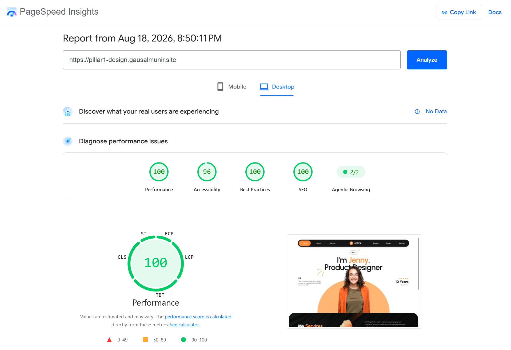
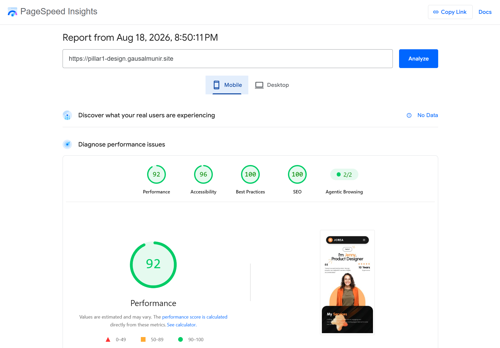

# Technical Assessment — Pillar 1: Design Implementation

Pixel-accurate, fully responsive Next.js application converting Figma design specifications into a state-of-the-art interface. Built as part of the **React Frontend Engineer (Junior – Mid Level)** UI challenge

---

## Live Demo

- **Live Demo**: [https://pillar1-design.gausalmunir.site](https://pillar1-design.gausalmunir.site)

---

## Tech Stack & Key Requirements

| Domain             | Technology / Tool | Specification                                                |
| ------------------ | ----------------- | ------------------------------------------------------------ |
| **Framework**      | Next.js 15+       | App Router architecture (`/src/app`)                         |
| **Language**       | TypeScript        | Strict mode enabled (`strict: true`), zero `any` types       |
| **Styling**        | Tailwind CSS v4   | CSS design tokens, custom `@theme` properties                |
| **Typography**     | Next Font         | `Urbanist` (Google Font) with CSS variable `--font-urbanist` |
| **Icons & Assets** | SVG & PNG         | Exported directly from Figma design assets                   |
| **SEO & Access**   | Semantic HTML5    | OpenGraph, Twitter Cards, Schema.org JSON-LD, Skip-links     |

---

## Getting Started & Local Setup

### Prerequisites

Ensure you have Node.js 18.x or later installed.

### Installation

1. **Navigate to the Pillar 1 directory:**

    ```bash
    cd technical-assessment-design-pillar1
    ```

2. **Install dependencies:**

    ```bash
    pnpm install
    # or npm install / yarn install
    ```

3. **Start the local development server:**

    ```bash
    pnpm dev
    # or npm run dev / yarn dev
    ```

4. Open `http://localhost:3000` in your browser.

5. **Build for production verification:**
    ```bash
    pnpm build
    ```

---

## Lighthouse Performance Report

|                  Desktop                   |                  Mobile                  |
| :----------------------------------------: | :--------------------------------------: |
|  |  |

---

## Component Architecture & Design System

The application is structured into modular, accessible, and reusable React components:

```
src/
├── app/
│   ├── globals.css
│   ├── layout.tsx
│   └── page.tsx
├── components/
│   ├── Navbar.tsx
│   ├── MobileMenu.tsx
│   ├── HeroSection.tsx
│   ├── GreetingBadge.tsx
│   ├── Testimonial.tsx
│   ├── RatingExperience.tsx
│   ├── ServicesSection.tsx
│   ├── ServiceCard.tsx
│   ├── SliderIndicators.tsx
│   └── icons/
```

---

## Figma Accuracy & Technical Highlights

### 1. Responsive Breakpoint Optimization

- Designed for **Desktop (1440px)** and **Mobile (375px)** design frames with smooth fluid scaling across intermediate screen sizes (`sm`, `md`, `lg`, `xl`).
- Mobile layout automatically transforms the desktop 3-card grid into an touch-friendly horizontal snap-carousel (`overflow-x-auto snap-x snap-mandatory`).

### 2. Custom CSS Masking (`service-card-cutout`)

- The bottom-right circular cutout on `ServiceCard` mockups is rendered using pure CSS radial gradient masks (`mask-image: radial-gradient(...)`) rather than static PNG overlays. This keeps the design fluid, crisp, and high-performance across all display resolutions.

### 3. Layered Hero & Pop-Out Character Architecture

- **Arch Backdrop (`#FEB273`)**: Positioned at the bottom of the hero center grid.
- **Jenny's Portrait (`hero-person.png`)**: Scaled and aligned to pop out cleanly over the top edge of the background arch and under/over text headings, strictly matching Figma visual proportions.
- **Decorative Scribbles (`vector-1`, `vector-2`)**: Pixel-aligned relative positioning under the letter "P" in "Product Designer" and above the "Hello!" pill badge.

### 4. Layered Background Blending (Services Section)

- Combines a dark surface (`#0D0D0D`) with a dark vector pattern texture (`services-pattern-bg.jpg`) and a high-vibrancy abstract fluid overlay (`services-bg.png`) set to `mix-blend-screen` with `opacity-90`.

---

## Accessibility & SEO

- **Semantic Landmark Tags**: Built with `<header>`, `<nav>`, `<main>`, `<section>`, and `<h1-h3>` hierarchy.
- **Keyboard Navigation**: Focus indicators (`focus-visible:ring-2 focus-visible:ring-accent-orange`) on all interactive controls and links.
- **Skip Navigation**: "Skip to main content" link for screen readers and keyboard users.
- **Structured Data**: JSON-LD Schema.org `Person` and `WebSite` meta embedded into document `<head>`.
- **Search Engine Optimization**: Complete metadata configuration including `openGraph`, `twitter`, canonical URL, and descriptive meta tag summaries.

---

## Bonus Features & Extra Polish

1. **Accessibility Standards**: Keyboard bypass links, standard ARIA labels (`aria-expanded`, `aria-controls`, `aria-labelledby`).
2. **Performance Optimizations**: Native Next.js `Image` with optimal sizing (`sizes="..."`, `priority` loading for above-the-fold assets).
3. **Smooth Scroll & Micro-interactions**: Hover lifts on service cards (`hover:-translate-y-2`), diagonal arrow translation (`group-hover:translate-x-0.5 group-hover:-translate-y-0.5`), and active tab styling.

---
